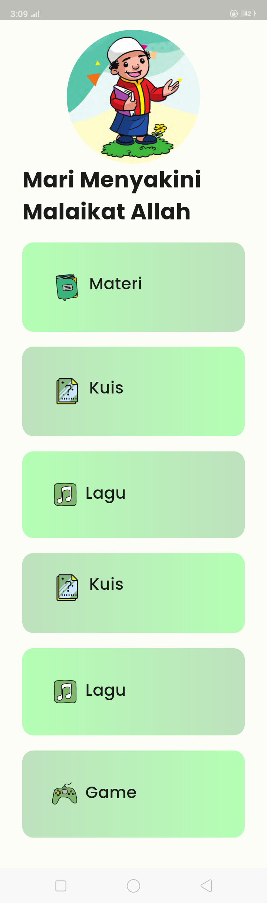
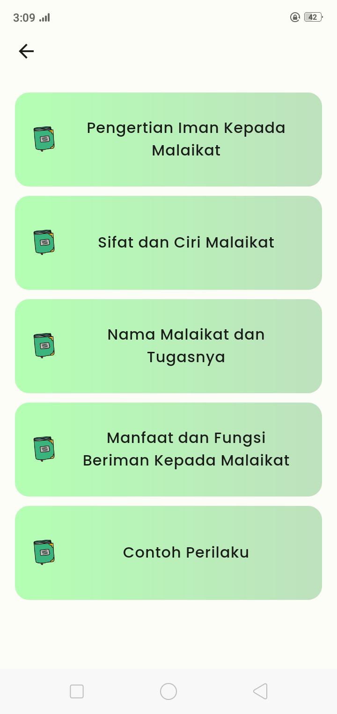
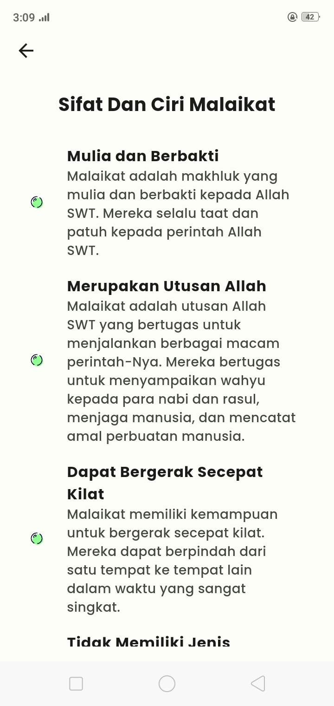
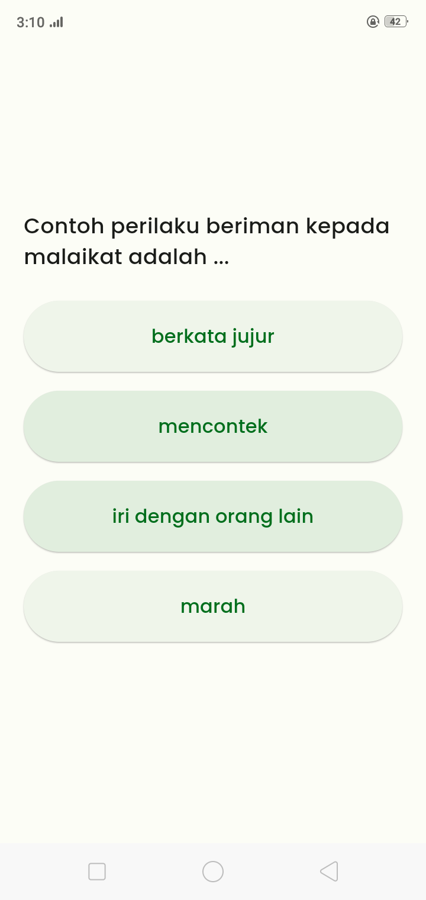
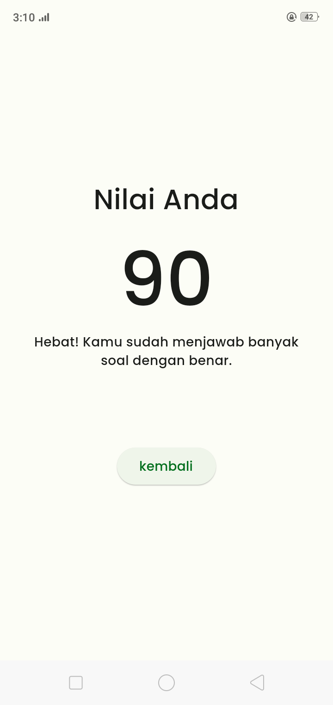

# semar-v2

ada tambahan 2 fitur, setelah semar-v1 is done, ada revisi

### why use this app
is for e-learning to elementary school. this app about "malaikat dalam agama islam"

### behind story
this is my first project freelance, and even this kinda of simple. I got pretty enough amount $$$

### PREVIEW
the 2 feature I add is button "Lagu" and "Game", if click "Lagu" is directly go to Youtube on list songs of "malaikat", then "game" is directly link to web of another Game from other people (the client want that)

well the picture above is kinda off because I took long screenshoot. but it's actually only 4 button

then this click "materi"

would have few lists "materi" so student can learn or gain knowladge from here

another thing, if click "kuis" in mainscreen, it is quiz with have value of the end 

